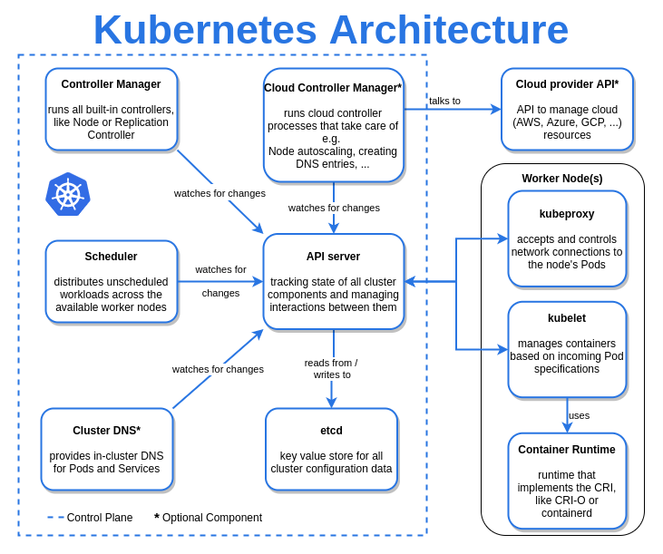
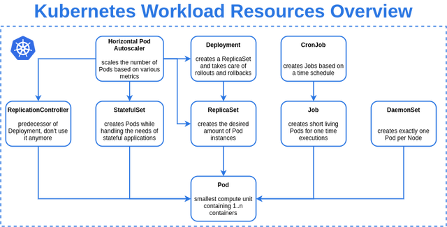

# Kubernetes Workshop part 1

## The basics from a users perspective

https://github.com/benmathews/KubernetesWorkshop

---

# Prerequisites

To complete this workshop you need some setup first.

- Install [stern](https://github.com/wercker/stern).
- Install [kubectl](https://kubernetes.io/docs/tasks/tools/install-kubectl/). And although not required, it is very helpful to have autocomplete configured.

``` bash
# bash-completion package should be installed first.
source <(kubectl completion bash) 
echo "source <(kubectl completion bash)" >> ~/.bashrc 
```

Clone this repo to get a sample app, Dockerfile, and kube config.

``` bash
git clone git@github.com:benmathews/KubernetesWorkshop.git
```

---

# Prerequisites - Kubectl Config

Set up the the configuration that will connect kubectl to your cluster with

``` bash
cp ~/.kube/config ~/.kube/config.bak
cp <location of repo>/k8sconfig ~/.kube/config
```

Before attending the workshop, you should be able to run this command and get a response.

``` bash
$ kubectl version
Client Version: version.Info{Major:"1", ...
Server Version: version.Info{Major:"1", ...
```

---

# Prerequisites - Registry Config Linux

Enable access to the registry on Linux

Add to /etc/docker/daemon.json

``` json
{
  "insecure-registries" : ["10.1.31.199:32000"]
}
```

``` bash
sudo systemctl restart docker
```

---

# Prerequisites - Registry Config MacOS

Add this to the Docker configuration

``` json
{
  "insecure-registries" : ["10.1.31.199:32000"]
}
```

Add the above json to the `Docker Engine` configuration in `Preferences`

- From the Mac status bar, go to `Docker | Preferences`
- Navigate to the `Docker Engine` section
- Integrate the above json into the displayed json
- Click `Apply & Restart`

---

# What is Kubernetes

An open-source system for automating

* deployment,
* scaling,
* and management

of containerized applications.

---



<!-- credit https://www.reddit.com/r/kubernetes/comments/k8kqdr/overview_of_kubernetes_architecture/-->

---

# Kubectl - Kubernetes CLI

Run these commands and understand the flags and output

``` bash
kubectl
kubectl version
kubectl explain
kubectl explain deployment
kubectl get nodes
kubectl describe nodes -h
kubectl describe nodes
```

---

# Namespaces

- Virtual clusters backed by the same physical cluster.
- Help different projects and teams to share a Kubernetes cluster.

Create a namespace for this workshop.

``` bash
kubectl create namespace <namespace name>
```

---

# Default Namespace

Kubectl has a `-n` parameter to specify which namespace the command refers to. If you are using a particular namespace most of the time, a default can be set.

``` bash
kubectl config set-context --current --namespace=<namespace name>
```

---

# Pod

- The smallest deployable units of computing that you can create and manage in Kubernetes.
- A group of one or more containers, with shared storage and network resources
- The shared context of a Pod is a set of Linux namespaces and cgroups

---

# Create and examine a pod

``` bash
kubectl run demopod --image=alpine -- sleep 1000000
kubectl get pod demopod
kubectl get pod demopod -o yaml
kubectl describe pod demopod
```

Shell into the pod and run some commands. Observe that you are in a container.

``` bash
kubectl exec -it demopod sh
```

Experiment with the flags for `kubectl run`.

``` bash
kubectl run -h
kubectl run demopod --image=alpine --labels='firstpod=true,effort=k8sworkshop' \
--env='foo=bar' --env='foo2=bar2' --dry-run=client -o yaml -- sleep 1000000
```

---

# Sample project

Build sample image

``` bash
cd KubernetesWorkshop/demowebapp/
docker build . -t demowebapp:v1.0.0
```

---

# Registry

Push your image into the local registry

``` bash
docker build . -t 10.1.31.199:32000/<your name>/demowebapp:v1.0.0
# or
docker tag demowebapp:v1.0.0 10.1.31.199:32000/<your name>/demowebapp:v1.0.0

docker push 10.1.31.199:32000/<your name>/demowebapp:v1.0.0
```

---


<!-- credit https://www.reddit.com/r/kubernetes/comments/k26je7/overview_of_builtin_kubernetes_workload_resources/-->

---

# Deployment

Provides declarative updates for Pods and ReplicaSets.

Deployment use cases:

- Update the state of pods. New image, env variables, etc.
- Rollback to previous revision.
- Scale up or down the number of pod replicas.
- Pause and resume rollout
- Monitor rollout status

---

# Deployment example

``` yaml
apiVersion: apps/v1
kind: Deployment
metadata:
  labels:
    app: demodeploy
  name: demodeploy
spec:
  replicas: 1
  selector:
    matchLabels:
      app: demodeploy
  strategy: {}
  template:
    metadata:
      labels:
        app: demodeploy
    spec:
      containers:
      - image: localhost:32000/<your name>/test:latest
        name: test
```

---

# Deployment practice

- Create a deployment.
- Examine it and the artifacts it creates

``` bash
kubectl create deployment demodeploy --image=localhost:32000/<your name>/demowebapp:v1.0.0
kubectl get deployment
kubectl describe deployment demodeploy
kubectl get deployment demodeploy -o yaml
kubectl get rs
kubectl get pods -o wide
kubectl port-forward <pod name> 8090:8080
curl localhost:8090
```

---

# Service

An abstract way to expose an application running on a set of Pods as a network service.

---

# Service example

``` yaml
apiVersion: v1
kind: Service
metadata:
  labels:
    app: demodeploy
  name: demodeploy
spec:
  clusterIP: 10.152.183.2
  clusterIPs:
  - 10.152.183.2
  ports:
  - port: 80
    protocol: TCP
    targetPort: 8080
  selector:
    app: demodeploy
  sessionAffinity: None
  type: ClusterIP
```

---

# Service practice

``` bash
kubectl expose deployment demodeploy --target-port=8080 --port=80
kubectl get service demodeploy
kubectl describe service demodeploy
kubectl port-forward svc/demodeploy 8090:80
curl localhost:8090
```

---

# Scale Deployment

``` bash
kubectl scale deployment demodeploy --replicas=3
kubectl get pods -l app=demodeploy
curl localhost:8090
```

---

# Labels and selectors

- Key/value pairs that are attached to objects
- Intended to be used to specify identifying attributes
- Do not imply semantics to the core system
- Can be used to organize and to select subsets of objects
- Creation time and subsequently added and modified at any time
- Each Key must be unique for a given object

---

``` yaml
kind: Pod
metadata:
  labels:
    app: demodeploy
    manager: kubelet
  name: demodeploy-7b594b6fd-9t585
spec:
...
```

``` yaml
kind: Service
metadata:
  labels:
    app: demodeploy
  name: demodeploy
spec:
  selector:
    app: demodeploy
```

---

# Logs

View logs with `kubectl log` or [stern](https://github.com/wercker/stern).

``` bash
kubectl logs -f <pod name>
stern -l app=demodeploy
```

---

# Kubectl edit

- Add a new label to the pod template in your deploy

``` bash
kubectl edit deploy demodeploy
```

---


---

# Assignment

- Modify the sample node program to return "Hello Universe".
- Create a new version of the docker image and push it to your local registry.
- Create a new deployment to serve the new version.
- Modify the service so that it routes traffic to both deployments
