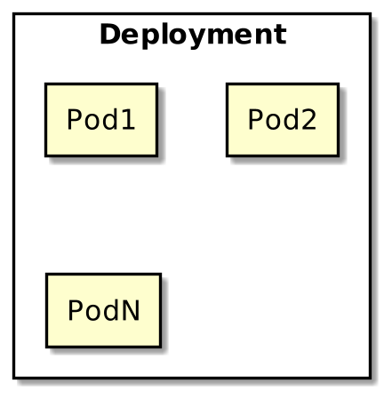

# Kubernetes Workshop part 2

## The basics from a users perspective

https://github.com/benmathews/KubernetesWorkshop

---

# Prerequisites

To complete this workshop you need some setup first.

- Install [kubectl](https://kubernetes.io/docs/tasks/tools/install-kubectl/). And although not required, it is very helpful to have autocomplete configured.

``` bash
# bash-completion package should be installed first.
source <(kubectl completion bash) 
echo "source <(kubectl completion bash)" >> ~/.bashrc 
```

Clone this repo to get a sample app, Dockerfile, and kube config.

``` bash
git clone git@github.com:benmathews/KubernetesWorkshop.git
```

---

# Prerequisites - Kubectl Config

Set up the the configuration that will connect kubectl to your cluster with

``` bash
cp ~/.kube/config ~/.kube/config.bak
cp <location of repo>/k8sconfig ~/.kube/config
```

Before attending the workshop, you should be able to run this command and get a response.

``` bash
$ kubectl version
Client Version: version.Info{Major:"1", ...
Server Version: version.Info{Major:"1", ...
```
---
# Prerequisets - /etc/hosts

Add this to your `/etc/hosts` file.

```
10.1.31.199 workshop-k8s
```
---

# Review - Pod

Shared storage and network resources


---

# Review - Deployment

Scaling and rollout



---

# Review - Service

Stable network address


---

# Review - Service


---

# Ingress


---

# Starting point for workshop

- Create a namespace.
- Set the namespace to be default in your `~/.kube/config`.
- Apply the startup yaml.
  - A deployment with two pods
  - A service referencing it

``` bash
kubectl apply -f Workshop2Yaml
```

---

# Ingress example

``` yaml
apiVersion: extensions/v1beta1
kind: Ingress
metadata:
  name: demodeploy
spec:
  rules:
  - host: hostname.com
    http:
      paths:
      - backend:
          serviceName: someservice
          servicePort: 8888
        path: /<namespace>/
```

---

# Create ingress to expose your service

- Start from example on previous page.
- Modify the serviceName, servicePort, and path.

## Useful commands

```
kubectl apply -f <filename>
kubectl describe ingress demodeploy
stern -n ingress -s1s .
```

---

# Rollout / Rollback practice

Practice modifying your deployment.

``` bash
kubectl edit deployment demodeploy
kubectl get replicaset
k rollout history deployment demodeploy
```

---
# Rollout demo

Demo only everyone running will exceed the capacity of the cluster.

``` bash
k scale deploy demodeploy --replicas=50
watch 'kubectl get deployment;kubectl get pods'
# Change container name to trigger rollout
kubectl rollout status deployment demodeploy
```

---

# Rollout demo continued

<!-- Explain. Default is to aggressive, edit to more conservitive and trigger new rollout. -->
``` yaml
strategy:
  rollingUpdate:
    maxSurge: 25%
    maxUnavailable: 25%
```

---

# Configmap and Secret 

## Configmap

An API object used to store non-confidential data in key-value pairs. Pods can consume ConfigMaps as environment variables, command-line arguments, or as configuration files in a volume.

## Secret 

 Let you store and manage sensitive information, such as passwords, OAuth tokens, and ssh keys. Storing confidential information in a Secret is safer and more flexible than putting it verbatim in a Pod definition or in a container image. 

---

# Configmap / Secret example

`kubectl create help secret sample --from-literal=foo=bar`
``` yaml
apiVersion: v1
kind: ConfigMap
metadata:
  name: sample
data:
  foo: bar
```
`kubectl create secret generic sample --from-literal=foo=bar`
``` yaml
apiVersion: v1
kind: Secret
metadata:
  name: sample
data:
  foo: YmFy
```

---

# Using Configmaps and Secrets

- Inside a container command and args
- Environment variables for a container
- Add a file in read-only volume, for the application to read

---

# Configmap usage example 

``` yaml
kind: Pod
spec:
  containers:
    - name: demo
      image: alpine
      command: ["sleep", "$(SLEEP_TIME)"]
      env:
        - name: SLEEP_TIME
          valueFrom:
            configMapKeyRef:
              name: volumeName
              key: sleepTime
      volumeMounts:
      - name: volumeName
        mountPath: "/config"
        readOnly: true
  volumes:
    - name: volumeName
      configMap:
        name: configurationMapName
        items:
        - key: "game.properties"
          path: "game.properties"
    - name: volumeNameForSecret
      secret:
        name: secretName
```

---

# Configmap and secret practice

 - Add a configmap and secret and reference them in the deployment
 - Use an environmental variable in the demo app
   - Use the `10.1.31.199:32000/demowebapp:v1.2.2` image which uses a FRIENDS env variable

---

# Pod Phase

`kubect get pod` 

- Pending
- Running
- Succeeded
- Failed
- Unknown

---

# Container State

`kubectl describe pod <pod name>`

- Waiting
- Running
- Terminated

---

# Pod Status

1. PodScheduled
1. ContainersReady
1. Initialized
1. Ready

---

# Container Probes

3 types

- Execution
- TCP Socket
- HTTP Get

---
# Container Probes

3 outcomes

- Success
- Failure
- Unknown

---
# Container Probes

3 probe types

- liveness
- readiness
- startup

---

# Probe example

``` yaml
apiVersion: apps/v1
kind: Deployment
spec:
  template:
    spec:
      containers:
      - name: demowebapp
        image: ....
        livenessProbe:
          failureThreshold: 3
          httpGet:
            path: /foo
            port: 80
          periodSeconds: 10
          successThreshold: 1
          timeoutSeconds: 1
```

---

# Probe practice

 -Add a failing liveness probe to the deployment
	 -Observe it failing w/ `kubectl describe`
	 -Correct the probe and see it rollout

---


